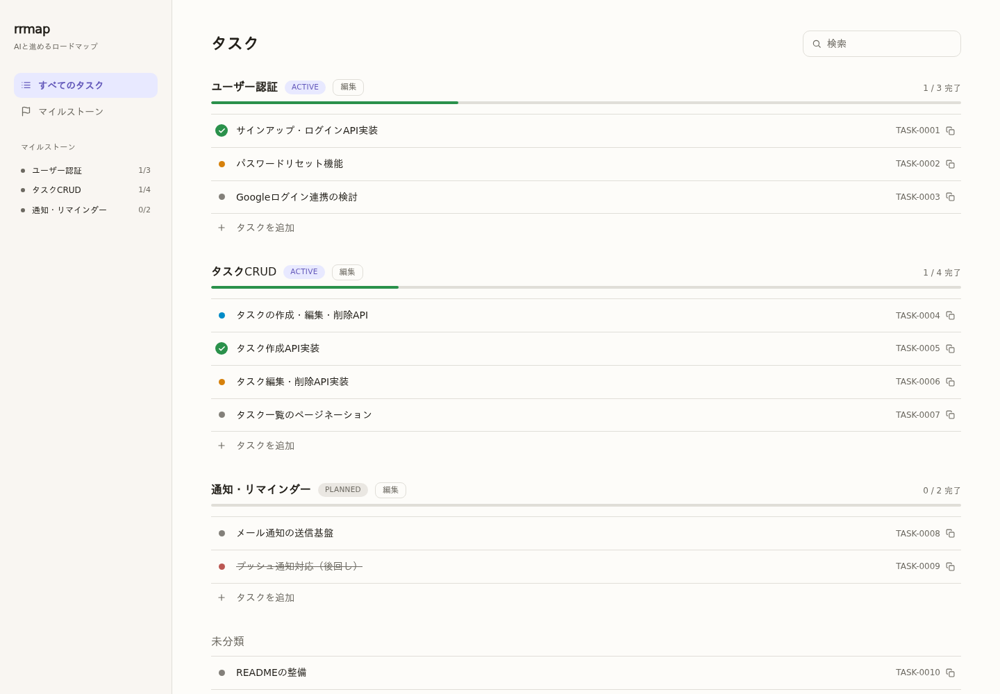
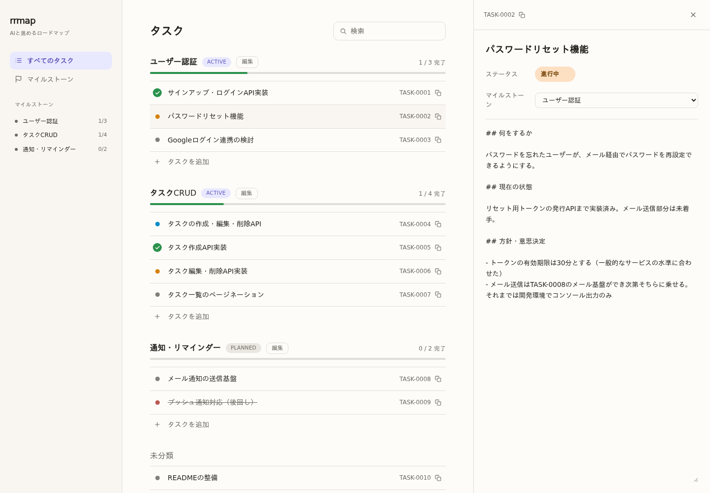

# rrmap

雑に書いたロードマップを、AIと一緒に開発を進めながら育てていくためのタスク管理ツール。

## rrmapは何をするツールか

AIと一緒に開発していると、最初は人間がざっくり書いたロードマップをもとに作業を進められます。しかし開発が進むにつれてタスクの粒度や内容は変わっていきますし、「どう実装することにしたか」という小さな意思決定も生まれます。かといって、そのすべてをロードマップに書き足していくと、単一ファイルには完了したタスクがどんどん溜まっていき、人にもAIにも扱いづらいものになっていきます。

rrmapは、ロードマップを**タスク単位のMarkdownファイル**として管理することでこれを解決します。各タスクには「何をするか」「現在どういう状態か」「どんな方針・意思決定をしたか」を書いておけます。ファイルは`.rrmap/`配下に1タスク1ファイルで置かれるだけなので、CLIを経由せず直接開いて編集してもかまいません。

## スクリーンショット

マイルストーンごとにタスクをグループ化して一覧表示します。



タスクをクリックすると、ステータス・所属マイルストーン・本文（Markdown）をその場で編集できます。



## インストール

現時点ではnpmには公開しておらず、リポジトリをcloneして使います（[Bun](https://bun.com)が必要です）。

```bash
git clone https://github.com/eetann/rrmap.git
cd rrmap
bun install
```

CLIは管理したいプロジェクトのルートディレクトリで実行する想定なので、`rrmap`という名前でパスを通しておくと便利です。

```bash
# 例: ~/.zshrc などに追加（パスはcloneした場所に合わせる）
alias rrmap="bun run /path/to/rrmap/src/cli.ts"
```

以降はこのエイリアスが使える前提で説明します。

## クイックスタート

管理したいプロジェクトのルートで、マイルストーンとタスクを作っていきます。

```bash
cd ~/my-app

rrmap milestone create "ユーザー認証"
# created milestone MILESTONE-0001: ユーザー認証

rrmap create "サインアップ・ログインAPI実装" --milestone MILESTONE-0001
# created task #TASK-0001: サインアップ・ログインAPI実装

rrmap list
```

実体は`.rrmap/tasks/TASK-0001.md`のようなMarkdownファイルです。着手したらステータスを変更し、

```bash
rrmap edit TASK-0001 --status in_progress
```

方針や意思決定を書きたくなったら、ファイルを直接開いて本文に追記します（CLIには本文を編集するコマンドはあえて用意していません）。

```markdown
---
id: TASK-0001
title: サインアップ・ログインAPI実装
status: in_progress
parent: null
milestone: MILESTONE-0001
---

## 方針・意思決定

- パスワードのハッシュ化にはbcryptを使う
```

タスクが大きくなってきたら、`--parent`を付けて子タスクに分割できます（親子関係は1階層のみ）。

```bash
rrmap create "パスワードリセット機能" --parent TASK-0001
```

## Web UIで見る

一覧性が欲しいときはWeb UIも使えます。管理したいプロジェクトのルートで起動してください。

```bash
cd ~/my-app
bun --hot /path/to/rrmap/src/web/server.ts
```

ブラウザで表示されたURL（デフォルトは http://localhost:3000 ）を開くと、上のスクリーンショットのような一覧・詳細編集ができます。

> **既知の制限:** WebUIの見た目（Tailwind CSS）は、起動時のカレントディレクトリ配下をスキャンして生成される仕組みのため、rrmap自身のソースを含まないプロジェクトディレクトリから起動すると、スタイルが正しく当たらないことがあります（[TASK-0007](.rrmap/tasks/TASK-0007.md)で対応予定）。現状はrrmapのタスク・マイルストーンを直接見比べたい場合はrrmapのリポジトリ自身をcloneした場所で`bun run dev`する運用を推奨します。

## ステータス

タスク:

| ステータス | 意味 |
|---|---|
| `draft` | とりあえず雑に書いた |
| `refined` | 実装の複雑さを考えてちゃんと書いた（タスクを分割した場合、分割元の親タスクはこの状態になる） |
| `in_progress` | 実装中 |
| `done` | 実装済み |
| `cancelled` | 中止 |

マイルストーン: `planned` / `active` / `completed`

`refined`を経由する必要はありません。`draft`のまま着手して`in_progress`にしてかまいません。

## CLIコマンド一覧

```bash
rrmap list [--status <status>] [--parent <id>] [--milestone <id>]   # タスク一覧
rrmap show <id>                                                     # タスクの詳細（本文込み）
rrmap create <title> [--parent <id>] [--milestone <id>]             # タスク作成（IDは自動採番）
rrmap edit <id> [--status <status>] [--title <title>]               # status/titleを変更

rrmap milestone list [--status <status>]     # マイルストーン一覧
rrmap milestone show <id>                    # マイルストーンの詳細（本文込み）
rrmap milestone create <title>               # マイルストーン作成（IDは自動採番）
rrmap milestone edit <id> [--status <status>] [--title <title>]

rrmap format   # タスク・マイルストーンのMarkdownフォーマットを表示
```

各コマンドの詳細は`--help`でも確認できます。

## AIエージェントと一緒に使う

rrmapはAIと一緒にロードマップを育てていくことを想定したツールです。[Claude Code](https://claude.com/product/claude-code)向けに、`.rrmap/`配下のファイルをどう扱うかをまとめたSkill（[.claude/skills/rrmap/SKILL.md](.claude/skills/rrmap/SKILL.md)）を同梱しています。導入したプロジェクトに`.rrmap/`ディレクトリを置いておけば、「タスクを作って」「進行中のタスクを教えて」といった指示でAIがCLI経由で操作してくれます。

## サンプル

[`demo/`](demo/)ディレクトリに、簡単なToDoアプリ開発を想定したサンプルのタスク・マイルストーンを置いています。上のスクリーンショットもこのデータを元にしています。CLIの動きを試したい場合は、`demo/`をカレントディレクトリにして`rrmap list`や`rrmap show TASK-0001`を実行してみてください（WebUIは前述の制限により`demo/`から起動してもスタイルが当たりません）。

## もっと詳しく

- [タスクファイルのフォーマット](docs/task-format.md)
- [マイルストーンファイルのフォーマット](docs/milestone-format.md)
- [ディレクトリ構成](docs/directory-structure.md)

rrmap自体の開発ロードマップ（このツールをrrmapでどう育てているか）は[docs/roadmap.md](docs/roadmap.md)を参照してください。
